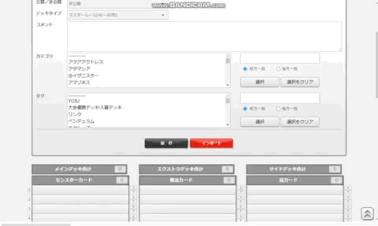

# 遊戯王DBデッキサポート

## Abstract

このアプリは公式カードデータベースのデッキ表示画面にエクスポート・インポート・ソート・シャッフルボタンを追加します。

OCGのみのカードのDB作成において、[ocg-card.com](https://ocg-card.com/)様を利用させていただいています。

## Usage
### Export
- デッキの内容が表示されている画面で**Export**ボタンを押すと、.ydkファイル(ADSのデッキ形式)としてダウンロードします。

### Import
- デッキ編集画面で**Import**ボタンを押して.ydkファイルを選択すると、その内容が自動で入力されます。
- **2021/02/11: 現在はカード名の入力が英語で行われますが、そのまま保存すれば問題は生じません。** (英語名または日本語名が正式に決まっていないカードのみ除外されます。)

### Sort
- デッキの内容が表示されている画面で**Sort**ボタンを押すと、新しい子ウィンドウで編集画面が開き、ソート後のデッキレシピが入力されます。
    入力完了後は**保存**ボタンが強調されるので、クリックしてください。ソート結果が保存され、子ウィンドウが閉じ、元ウィンドウが更新されます。
    なお、ソートには主として遊戯王dbから取得した情報を利用するので、発売直後のカードにも対応しています。
    ソート基準はオプションや画面内で調整できるようにする予定です。
    また、ソート機能は自身のデッキに対してのみ使用可能です。

### Shuffle

- デッキの内容が表示されている画面で**Shuffle**ボタンを押すと、メインデッキのカード画像がランダムにシャッフルされます。ドローシミュレーターとしてお使いください。なお、保存されているカードの並び順はシャッフルされません。

## News

- **2021/02/11: Databaseを自動更新するようにしました。**
- 2022/04/18: v0.8: 遊戯王DBのHTML要素についての大幅な変更に対応しました。
- 2022/04/26: v0.9: ソート機能を追加しました。

## Install

### Chrome Store
Chrome Storeの[遊戯王DBデッキサポート](https://chrome.google.com/webstore/detail/jdgobeohbdmglcmgblpodggmgmponihc)からインストールできます。

### GitHub
GitHubから本拡張機能をインストールする場合、以下の手順になります。
1. [zip形式などでダウンロード](https://github.com/TomoTom0/YGO_deck_extension/archive/main.zip)し、解凍する。
2. Chromeの拡張機能管理画面に移動して「**パッケージ化されていない拡張機能を読み込む**」から、解凍したファイルのうちsrcフォルダを選択する。

## Caution

~~発表直後のカードや国内未発売のカードについては対応していない場合があります。~~

2021/3/11追記: 国内未発売のカードを除き、ほとんどの場合に対応できるようになりました。たまに、例外があります。

## Contact

- [お問い合わせ](https://docs.google.com/forms/d/e/1FAIpQLSdh2wRCUWpX6ZLfma-g5O46eD93wOPHpDHWQGxdOcJLmm_tGQ/viewform?usp=sf_link)

## License

MIT
