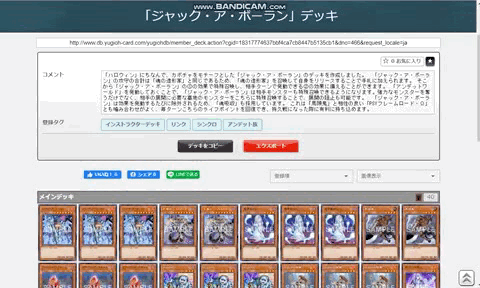
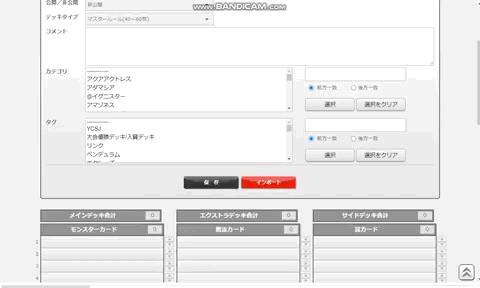

# 遊戯王DBデッキサポート

## Abstract

公式カードデータベースのデッキ画面にMouseUIモードやExport / Import / Sort / Shuffleボタンを追加します。

DB作成における古いOCGカードのid収集において、[ocg-card.com](https://ocg-card.com/)様を利用させていただいています。

## Usage

### MouseUI

- **遊戯王DBのデッキ編集が、マスターデュエルのようにマウスを主体としたUI(MouseUI)で操作できます**。
- テキストベースとMouseUIの画面はボタンエリアの**Text/Image**で切り替えできます。
- カードの移動はマウスのクリックで行います。

|From|Left|Wheel|Right|
|-|-|-|-|
|Main/Extra| Sideへ移動|  (Main/Extraに)1枚追加| 削除(Tempへ)|
|Side| Main/Extraへ移動|  (Sideに)1枚追加| 削除(Tempへ)|
|Temp|Main/Extraへ移動|Main/Extraに追加|Sideに移動|
|Search|Main/Extraへ追加|カードのページを開く|Sideへ追加|

- クリックモードの切り替えは**Click|MOVE CARD/open url**で行います。
    - **OPEN URL**モードではLeft/Wheelクリックでカードのページを開きます。(カードの移動は行いません。)
    - **MOVE CARD**モードでも、Ctrl+Wheelクリックでカードのページを開きます。
- **Reload & Sort**ボタンをクリックすれば、textの情報に合わせてデッキ画像をリセットします。

### Search Area in Deck Edit mode

- MouseUI画面の導入に合わせて、カード検索エリアをデッキ編集画面に追加しました。
- 公式のカード検索画面と同様のUI・機能を備えています。
- クリックでの移動に関する説明は、前節の表に含んでいます。
- **Search SHOW/HIDE**ボタンで検索エリアの表示・非表示を切り替えます。

## Side Change in Deck View Mode

- デッキ閲覧画面でサイドチェンジを模したカード移動が行えます。
- 検索エリアがないことを除き、デッキ編集画面のMouseUIモードの表と同様です。

- **SideChange|L:Reset/R:OFF**をLeftクリックすれば、初期のカード順にResetされます。
- **SideChange|L:Reset/R:OFF**をRightクリックすれば、SideChangeモードのON/OFFが切り替わります。
    - SideChangeモードがOFFのとき、Left/Wheelクリックでカードのページを開きます。(カードの移動は行いません。)
- **Sort & Save**をクリックでソートした上で保存します。

## Left/Wheel/Right Click

各種機能のクリックで「Left/Wheel/Right」を区別できるようになりました。
「L:AAA/M:CCC/R:BBB」という表示のボタンは、LeftクリックでAAA、RightクリックでBBB、Wheelクリック (Middleクリック)でCCCを行います。

### Export
- デッキ閲覧画面で**Export**ボタンを押すと、クリックしたボタンに応じて各カードのパスワード、cid、名前のいずれかが表記されているファイルをダウンロードします。

### Import
- デッキ編集画面で**Import**ボタンを押して各カードのパスワードが表記されているファイルを選択すると、その内容が自動で入力されます。

### Shuffle/Sort
- **Shuffle/Sort**ボタンを左/右クリックすると、そのエリアのカードがShuffle/Sortされます。(これらは保存されているカードの並び順に影響しません。)
    - この機能はデッキ閲覧画面・編集画面の両方で利用できます。
- デッキ閲覧画面にて**Sort & Save**ボタンを押すと、デッキレシピがソートされて**その結果が保存され、自動でページが更新されます。**
- デッキ編集画面にて**Reload & Save**ボタンを押すと、テキストエリアからデッキレシピを再読み込みしてソートされた結果が入力されます。(レシピの保存は別途行う必要があります。)

## News

- **2021/02/11: Databaseを自動更新するようにしました。**
- 2022/04/18: v0.8: 遊戯王DBのHTML要素についての大幅な変更に対応しました。
- 2022/04/26: v0.9: ソート機能を追加しました。シャッフル機能を追加しました。
- 2022/05/02: v0.10: Rest APIを用いてデッキレシピを保存するようになりました。DBの作成に公式遊戯王DBの情報を利用するようにしました。
- 2022/06/01: v1.0: デッキ編集画面にMouseUIモードの導入を行いました。他にもマウス操作に関する機能を多数追加しました。

## Install

### Chrome Store
Chrome Storeの[遊戯王DBデッキサポート](https://chrome.google.com/webstore/detail/jdgobeohbdmglcmgblpodggmgmponihc)からインストールできます。
[オプションページ](chrome-extension://jdgobeohbdmglcmgblpodggmgmponihc/script/options.html)で各種設定を変更できます。

### GitHub
GitHubから本拡張機能をインストールする場合、以下の手順になります。
1. [zip形式などでダウンロード](https://github.com/TomoTom0/YGO_deck_extension/archive/main.zip)し、解凍する。
2. Chromeの拡張機能管理画面に移動して「**パッケージ化されていない拡張機能を読み込む**」から、解凍したファイルのうちsrcフォルダを選択する。

## Caution

~~発表直後のカードや国内未発売のカードについては対応していない場合があります。~~

2021/3/11追記: 国内未発売のカードを除き、ほとんどの場合に対応できるようになりました。まれに例外があります。

## Feauture Work

- [x] マスターデュエルのようなデッキ編集画面 (-> v1.0)
- [x] データベース作成で ocg-card.com 様に依存しないようにする (->日本語・英語以外の言語への対応)
- [ ] デッキごとのフォルダ分けないしタグ付けによる管理
- [ ] 編集対象のデッキの切り替えをスムーズに
- [ ] デッキレシピのスクショ作成
## Contact

- [お問い合わせ](https://docs.google.com/forms/d/e/1FAIpQLSdh2wRCUWpX6ZLfma-g5O46eD93wOPHpDHWQGxdOcJLmm_tGQ/viewform?usp=sf_link)

## License

MIT
