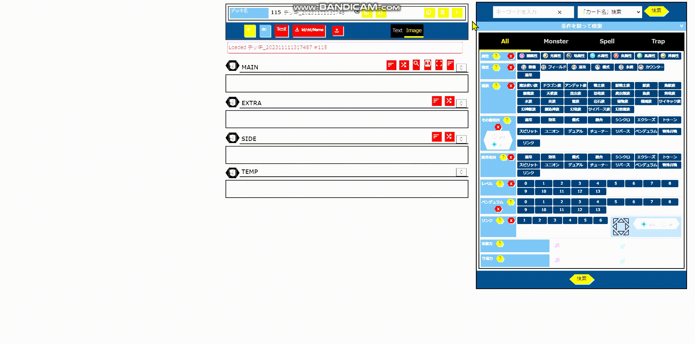
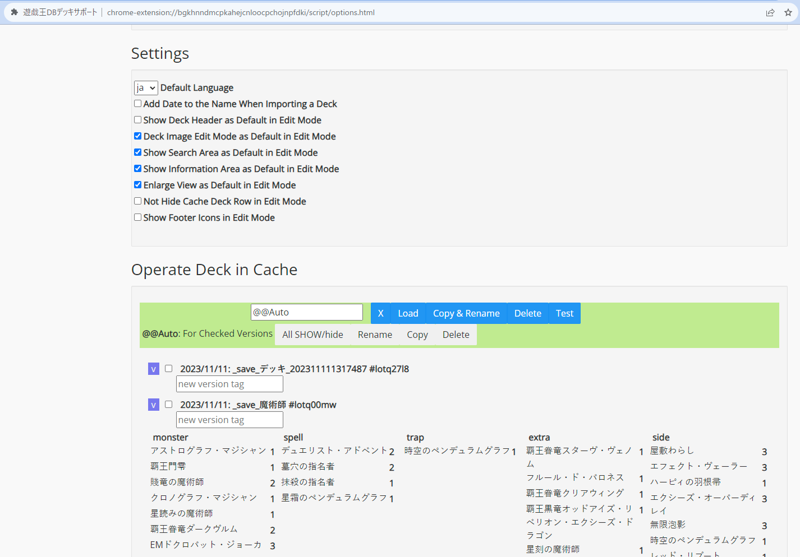

# 遊戯王DBデッキサポート Update@v2.1

## Abstract

- デッキ編集画面左側に「Infoエリア」を作成しました。
- ボタンの多くがアイコン表示されるようになりました。
- デッキ編集画面にFitモードが導入されました。
- その他、多くの修正を行いました。

## Deck Edit Mode

### Mouse UI

- **遊戯王DBのデッキ編集が、マスターデュエルのようにマウスを主体としたUI(MouseUI)で操作できます**。
- テキストベースとMouseUIの画面はボタンエリアの**Text/Image**で切り替えできます。
- カードの移動はマウスのクリックで行います。
- Ctrl+WheelクリックまたはCtrl+右クリックで新しいタブでカードのページを開きます。
- デッキ閲覧画面でも同様にカード画像の移動ができます。

|From|Left|Wheel|Right|
|-|-|-|-|
|Main/Extra| Sideへ移動|  (Main/Extraに)1枚追加| 削除(Tempへ)|
|Side| Main/Extraへ移動|  (Sideに)1枚追加| 削除(Tempへ)|
|Temp|Main/Extraへ移動|Main/Extraに追加|Sideに移動|
|Search, Info|Main/Extraへ追加|カードのページを開く|Sideへ追加|

-  デッキ閲覧画面に戻る
-  Headerの省略の有無を切り替える

### Deck Manager

- デッキレシピの保存、読み込みなどをページを切り替えることなく行うことができます。
    -  デッキレシピを保存する
    -  デッキレシピを読み込む
    -  デッキレシピを複製する
    -  デッキレシピを削除する
    -  空のデッキレシピを新規作成する

- 公式の遊戯王DBとは別に、Chrome拡張機能のキャッシュ内にデッキを保存することもできます。
    - 単純な保存・読み込みなら公式DBに保存するよりも高速です。
    - Optionページでまとめて確認、削除することができます。(現時点ではOptionページで画像付きのデッキレシピを確認することはできません。)
- キャッシュデッキ機能では、デッキ名に加えてversion名を付けて版管理することができます。
    - デッキを複製して保存しておかずとも、過去のレシピと比較する必要はありません。
- デッキレシピの保存時や削除時には、`@@Auto`に`_delete_Zoodiac`のようなバージョン名で自動保存されます。

### Search Area

- カード検索エリアをデッキ編集画面右側に追加します。
- 公式のカード検索画面と同様のUI・機能を備えています。
- クリックでのカードの移動に関する説明は、前節の表に含んでいます。
-  検索エリアの表示・非表示を切り替える

### Info Area

- 情報エリアをデッキ編集画面左側に追加します。
- ページを切り替えることなく、各カードの詳細や関連カード、Q&Aを確認できます。
- 各カード画像をダブルクリックまたはCtrl+左クリックすることで、情報エリアでページを開きます。
- (カード画像を除く)情報エリア内のリンクを(シングル)クリックすることで、情報エリアでページを開きます。
- クリックでのカードの移動に関する説明は、前節の表に含んでいます。
-  情報エリアの表示・非表示を切り替える

### Fit Editor

- ページからデッキ編集に関係しない要素を排除して、デッキ編集に画面を最適化します。
-  FitモードのON/OFFを切り替える

## Other Features

### Shuffle/Sort

- Main, Extra, SideのカテゴリごとにカードをShuffle/Sortすることができます。
    - これらは保存されているカードの並び順に影響しません。
    - この機能はデッキ閲覧画面・編集画面の両方で利用できます。
-  Shuffleする
-  Sortする

### Import/Export

- デッキレシピをImport/Exportすることができます。カードのパスワード(id)、カードゲームID(cid)、カード名(Name)の任意の形式を選択することができます。
    - Exportボタンの`id/cid/Name`には、左/Wheel/右クリックがそれぞれ対応しています。
    - Importの際はid、cid、カード名のいずれからなるファイルでも対応しています。(詳細な形式はExportファイルで確認してください。)
-  デッキレシピをExportする
-  デッキレシピをImportする

## Option Page

- [拡張機能のOptionページ](chrome-extension://jdgobeohbdmglcmgblpodggmgmponihc/script/options.html)で各種設定を変更できます。
- キャッシュに保存したデッキレシピを確認、削除、Exportすることができます。

## Contact

- [お問い合わせ](https://docs.google.com/forms/d/e/1FAIpQLSdh2wRCUWpX6ZLfma-g5O46eD93wOPHpDHWQGxdOcJLmm_tGQ/viewform?usp=sf_link)

